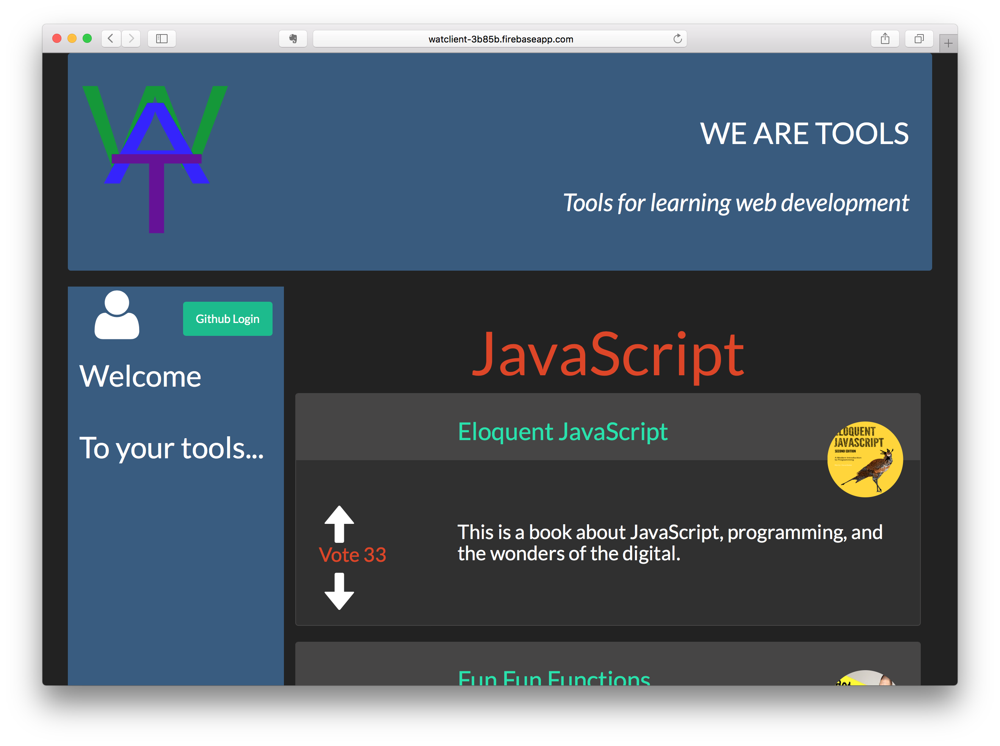

# WAT



* This repo is the __server-side__ of our decoupled app.
* The __client side__ is live on the web here: https://watclient-3b85b.firebaseapp.com/
* WAT is a Reddit clone geared toward providing resources for learning full-stack web development, with the MVP being focussed on JavaScript.
* Visitors can view all the learning resources (videos, websites, books, etc.).
* Registered users can Add resources, Comment on them, and add their favorites to a list.

### Created By

* Andrew Vandermeer
* Andy Knolla
* Christopher Comella
* Steven Lawson

### Key Technologies Used

* [React](https://facebook.github.io/react/)
* [Node.js](https://nodejs.org)
* [Express](http://expressjs.com)
* [Knex.js](http://knexjs.org)
* [PostgreSQL](https://www.postgresql.org)
* [Passport](http://passportjs.org) (GitHub OAuth 2 strategy)
* [Heroku](http://heroku.com)

### Routes

__OAuth:__    
* /auth/github - Login user.
* /logout - Logout user.

__API:__    
* Root route: api/v1
* Endpoints:
  * /categories - Returns all categories.
  * /resources - Returns all resources.
  * /resources/:id - Returns a resource by its id.
  * /resources/categories/:category - Returns all resources in a given category.

### Dependencies

* A [GitHub](http://github.com) account.
* PostgreSQL
* Node.js

### Run Locally

1. Create a new OAuth app on GitHub: https://github.com/settings/applications/new
2. Enter these settings on the GitHub OAuth app settings page:
  * Homepage URL: https://watserver.herokuapp.com
  * Authorization callback URL: https://watclient-3b85b.firebaseapp.com
2. Clone project and cd into project directory.
3. Edit the .env file as per the .env.example file.
4. Run these commands:
```
$ createdb wat
$ npm i
$ knex migrate:latest
$ knex seed:run
$ npm start
```
Then visit:    
http://localhost:3000/api/v1/resources   
[or any of the other API routes listed above]

### Use Online

https://watserver.herokuapp.com/api/v1/resources    
[or any of the other API routes listed above]

### jQuery AJAX Request Code Sample

```javascript
$(document).ready(function() { 
	$.ajax({   
		url: "https://watserver.herokuapp.com/api/v1/resources/categories/javascript",
		   success: function(result) {    
      // Do whatever you want with the result here, such as:
      for (var i = 0; i < result.resources.length; i++) {     
				console.log(result.resources[i])    
			}   
		}  
	});
});
```
